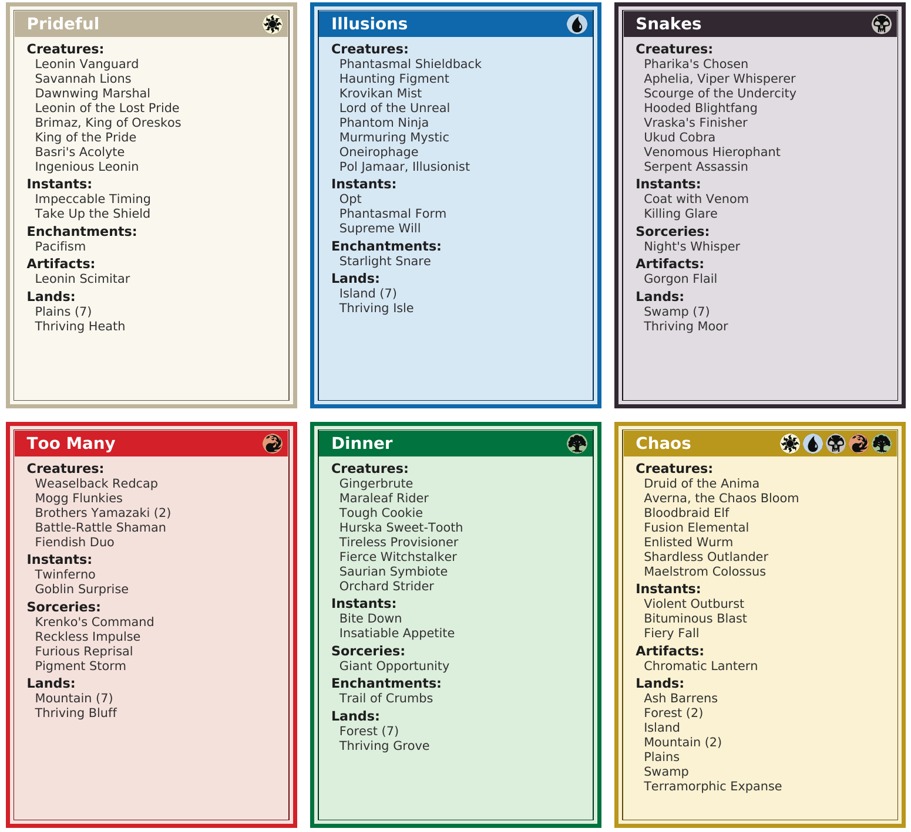

# jumpstart-decklists

A Go CLI tool that takes a text decklist for a Magic: The Gathering Jumpstart pack and generates a printable PDF decklist card with a color-identity-matched border. Each card is sized at 61 x 86mm (slightly smaller than the 63 x 88mm MTG card) so it doesn't extend past the rounded corners of a real card when sleeved together. See [Output](#output) for details.



### Printing and Cutting

Each card is printed with a colored bleed margin extending beyond the card border. This means you don't have to carefully cut along the border lines — cut anywhere in the bleed area and the result still looks clean. The bleed areas of adjacent cards touch with no white gaps to minimize wasted paper.

To use: print the PDF at 100% scale (no "fit to page"), cut out each card along the outer border, and optionally round the corners. Slide the card in front of a real MTG card in a sleeve.

## Install

```bash
go install github.com/jkblevins/jumpstart-decklists@latest
```

Make sure `$(go env GOPATH)/bin` is on your `PATH`:

```bash
export PATH="$PATH:$(go env GOPATH)/bin"
```

Or build from source:

```bash
git clone https://github.com/jkblevins/jumpstart-decklists.git
cd jumpstart-decklists
go build -o jumpstart-decklists .
```

## Usage

```bash
jumpstart-decklists decklist.txt
```

### Input Format

Plain text file with one deck:

```
Goblin Rush

1 Goblin Guide
2 Lightning Bolt
1 Reckless Bushwhacker
3 Mountain
```

- First non-blank line is the deck name.
- Remaining lines: `<quantity> <card name>`.
- Blank lines and `//` comments are ignored.
- Optional color override: append `[X]` to the deck name (see [Color Override](#color-override)).

### Batch Mode

Separate multiple decks with `---`:

```
Goblin Rush

1 Goblin Guide
2 Lightning Bolt
3 Mountain
---
Forest Friends

1 Llanowar Elves
2 Giant Growth
4 Forest
```

Single deck produces a card-sized PDF. Multiple decks produce a letter-size PDF with a 3x3 grid.

## Output

Each card includes:

- A color-matched border and tinted background based on the deck's color identity
- Deck name centered in white on the color bar
- Cards grouped by type with bold headers
- Singles displayed by name only (e.g., `Gruul Signet`), multiples as `Name (N)` (e.g., `Mountain (5)`)

### Color Identity

The border and background color is determined by the deck's color identity:

- **Mono-colored** decks (all cards share one color) get that color's scheme
- **Multi-colored** decks (cards with 2+ distinct colors) get a gold/multicolor scheme
- **Colorless** decks (no colored cards) get a gray scheme

#### Color Override

You can override the auto-detected color by appending a color code in brackets to the deck name:

```
Azorius Senate 1 [W]

1 Swords to Plowshares
1 Counterspell
---
Azorius Senate 2 [U]

1 Counterspell
1 Swords to Plowshares
```

Valid codes: `W` (white), `U` (blue), `B` (black), `R` (red), `G` (green), `M` (multicolor), `C` (colorless). The bracket suffix is stripped from the deck name. The override only affects the border and background color — mana symbols in the title bar are still auto-detected.

To use literal brackets in a deck name, escape them with backslashes: `Goblins \[Part 1\]`.

### Card Grouping

Cards are grouped by type in this order:

1. Creatures
2. Planeswalkers
3. Instants
4. Sorceries
5. Enchantments
6. Artifacts
7. Lands

#### Multi-type cards

Cards with multiple types are classified by this priority:

1. Land
2. Creature
3. Planeswalker
4. Instant
5. Sorcery
6. Enchantment
7. Artifact

A Land Creature (e.g., Dryad Arbor) goes under Lands. An Artifact Creature goes under Creatures.

### Sorting

Within each group, cards are sorted by converted mana cost (ascending), then alphabetically by name for ties. Lands are sorted alphabetically only.

## Card Data

Card metadata is fetched from [Scryfall](https://scryfall.com/) and cached locally at `~/.cache/jumpstart-decklists/` for one week. API rate limits are respected (100ms between requests).
